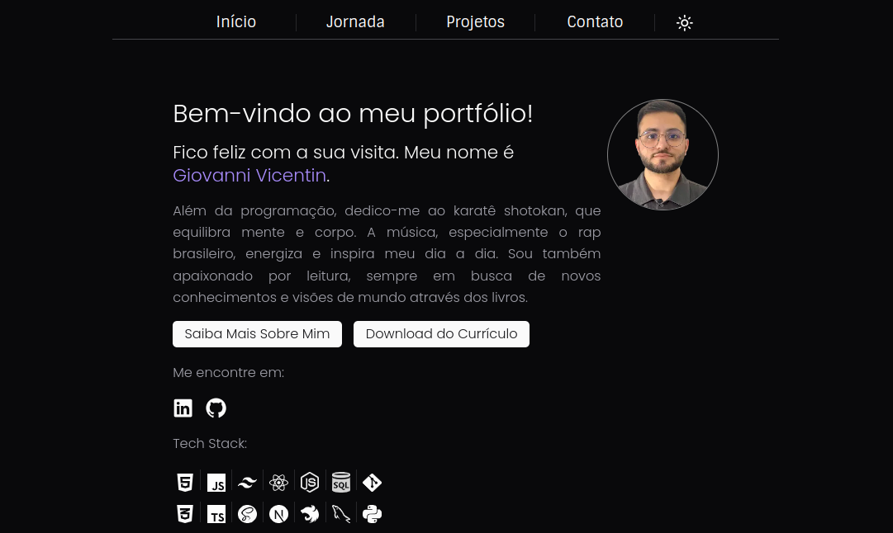

# Portfolio

## Overview

Welcome to my personal portfolio project, crafted using the latest web technologies including Next.js with React, Tailwind CSS, ShadCUI for component styling, and Resend with Resend API for email functionalities. This project serves as a comprehensive showcase of my professional journey, personal projects, and a way to contact me.

## Live Demo



_This image gives a glimpse into the user interface of my portfolio. For a full experience, please visit the live site when it becomes available._

## Features

- **Main Page:** An engaging introduction to who I am, with a sleek, modern design.
- **Journey Page (`/journey`):** A detailed timeline or narrative of my professional journey.
- **Projects Page (`/projects`):** A gallery of my personal projects, demonstrating my skills and interests.
- **Contact Page (`/contact`):** A user-friendly form to get in touch with me, powered by Resend API.

## Getting Started

To get a local copy up and running, follow these simple steps:

1. Clone the repository:

   ```bash
   git clone https://github.com/giovannivicentin/portfolio
   ```

2. Install NPM packages:

   ```bash
   npm install
   # or
   pnpm install
   # I used pnpm
   ```

3. Run the development server:

   ```bash
   npm run dev
   # or
   pnpm dev
   # or
   yarn dev
   ```

4. Open [http://localhost:3000](http://localhost:3000) with your browser to see the result.

## Technologies Used

- **Next.js & React:** For robust front-end development and server-side rendering.
- **Tailwind CSS:** For styling with a utility-first CSS framework.
- **ShadCUI:** A library for beautiful, responsive components.
- **Resend with Resend API:** To handle email sending functionalities seamlessly.

## License

Distributed under the MIT License. See `LICENSE` for more information.
